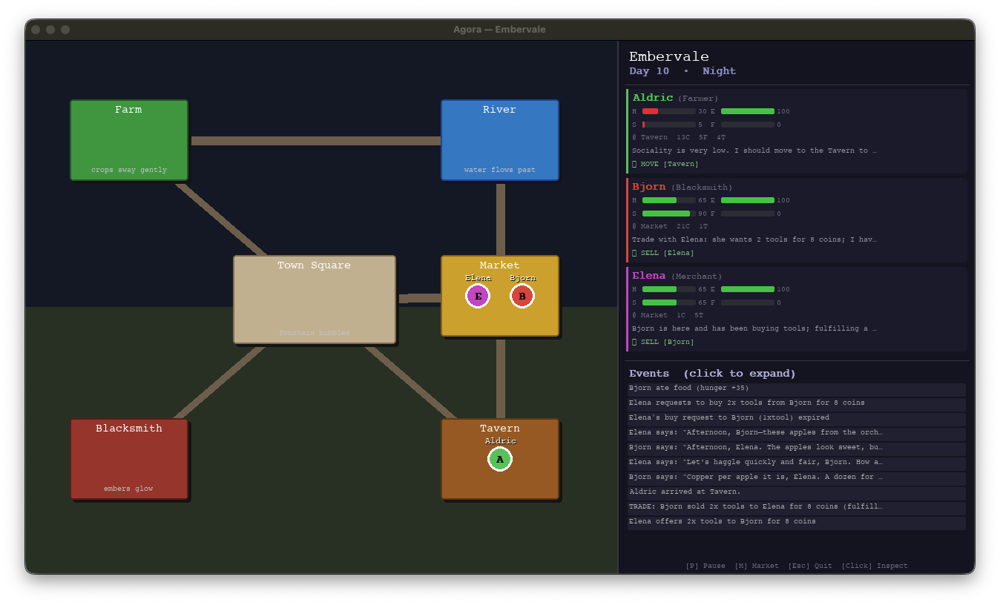

# Agora



> *A medieval village where AI agents live, work, trade, and talk — autonomously.*

Agora is a multi-agent simulation set in the village of **Embervale**. Each villager is powered by a large language model and makes their own decisions every turn: where to go, what to work on, when to eat, and who to trade with. They have needs that decay over time, an economy driven by supply and demand, and conversations that emerge naturally from proximity.

The result is a self-sustaining little world you can watch unfold.

---

## How it works

Each simulation tick, every villager:

1. **Perceives** their environment — location, nearby agents, inventory, needs, pending trade offers, recent events
2. **Reasons** via an LLM call and returns a structured JSON decision
3. **Acts** — moves, works, rests, eats, buys, or sells
4. **Converses** with nearby villagers when their social need is low

Time passes in five phases: **Dawn → Morning → Afternoon → Evening → Night**, each affecting energy recovery, decision-making, and atmosphere.

### Villagers

| Name   | Role        | Workplace   | Produces |
|--------|-------------|-------------|----------|
| Aldric | Farmer      | Farm        | Food (costs tools) |
| Bjorn  | Blacksmith  | Blacksmith  | Tools    |
| Elena  | Merchant    | Market      | — (trades) |

### Economy

Villagers negotiate trades peer-to-peer using a two-step offer/accept protocol:
- **SELL** posts a sell offer to a specific agent; they accept with **BUY**
- **BUY** posts a buy request; the seller fulfills with **SELL**
- Offers expire after 3 ticks if not matched
- Market rates are computed dynamically from current inventories

### Needs system

Each agent tracks four needs (0–100):

| Need        | Decays | Restored by |
|-------------|--------|-------------|
| Hunger      | ✓      | EAT         |
| Energy      | ✓      | REST / STAY |
| Sociality   | ✓      | Conversations |
| Fulfillment | ✓      | Working at craft location |

When a need drops below 30, the agent sees a `[LOW!]` warning in their context and is encouraged to prioritize it.

---

## Visualization

A Pygame window renders the village in real time:

- **Map panel** — top-down view of Embervale with roads, buildings, and animated agent avatars that smoothly lerp between locations
- **Sidebar** — live agent cards showing needs bars, inventory, last thought, and last action
- **Event log** — color-coded stream of recent actions and trades
- **Inspect mode** — click any agent to open a detailed overlay

Controls: `[P]` pause · `[Esc]` quit · `[Click]` inspect agent

---

## Getting started

### Prerequisites

- Python 3.12+
- [uv](https://github.com/astral-sh/uv) (recommended) or pip
- An OpenAI API key **or** a running [LM Studio](https://lmstudio.ai/) instance

### Install

```bash
git clone https://github.com/your-username/agora.git
cd agora
uv sync
```

### Configure

Copy `.env.example` to `.env` and set your API key:

```bash
OPENAI_API_KEY=sk-...
```

Model and simulation settings live in [config.py](config.py):

```python
class ModelConfig:
    provider: str = "lmstudio"          # "openai" or "lmstudio"
    model_id: str = "qwen/qwen3.5-9b"
    context_window: int = 8192

class SimConfig:
    village_name: str = "Embervale"
    tick_delay: float = 2.0           # seconds between simulation steps
```

To use a local model via LM Studio, set `provider = "lmstudio"` and point `model_id` at the loaded model's identifier.

### Run

```bash
uv run main.py
```

State is saved automatically to `tmp/` when you close the window. Run again to resume from where you left off.

---

## Project structure

```
agora/
├── main.py          # Entry point, simulation loop, villager definitions
├── agents.py        # VillagerAgent — LLM wrappers, prompt building, decision parsing
├── world.py         # World state, locations, events, trade offers
├── actions.py       # Action handlers (move, work, rest, eat, sell, buy)
├── economy.py       # Market rate computation, production rules, offer expiry
├── persistence.py   # Save / load state (JSON)
├── visualization.py # Pygame renderer (map, sidebar, agent cards, events)
└── config.py        # ModelConfig, SimConfig
```

---

## Extending Agora

**Add a villager** — append an entry to the `VILLAGERS` list in [main.py](main.py) with a name, role, personality, starting location, and inventory.

**Add a location** — extend `_setup_village()` in [world.py](world.py) and add its pixel rect and color to [visualization.py](visualization.py).

**Add an action** — define a handler in [actions.py](actions.py), register it in `_HANDLERS`, and add it to the system prompt in [agents.py](agents.py).

**Swap the model** — change `ModelConfig` in [config.py](config.py). Any model accessible through the [Agno](https://github.com/agno-agi/agno) framework can be plugged in.

---

## Dependencies

| Package | Purpose |
|---------|---------|
| [agno](https://github.com/agno-agi/agno) | LLM agent framework |
| [pygame](https://www.pygame.org/) | Real-time visualization |
| [openai](https://github.com/openai/openai-python) | OpenAI model provider |
| python-dotenv | Environment variable loading |

---

## License

MIT
